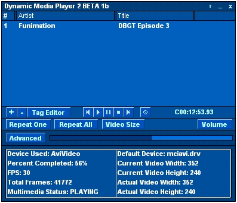



## Dynamic Media Player 2 \(BETA 1b\)

### Description

This is the second upload of my Media Player, it plays the following media types:

 

*.avi;*.mpg;*.dat;*.mpeg;*.mpe;*.mp3;*.mp2;*.mp1 *.wav;*.aif;*.aiff;*.aifc;*.au;*.mv1;*.mov;*.mpa *.qt;*.snd;*.mpm;*.mpv;*.enc;*.mid;*.rmi;*.vob *.wma;*.wmv

 

Please vote, and leave feedback.

Now completely commented!

Many bug fixes since BETA 1a
 
### More Info
 
File

Music and video

None that I know of, you tell me!

             |
---                |---
**Submitted On**   |2002-05-27 15:46:52
**By**             |[Paranoid\_Android](https://github.com/Planet-Source-Code/PSCIndex/blob/master/ByAuthor/paranoid-android.md)
**Level**          |Intermediate
**User Rating**    |4.7 (33 globes from 7 users)
**Compatibility**  |VB 5\.0, VB 6\.0
**Category**       |[Sound/MP3](https://github.com/Planet-Source-Code/PSCIndex/blob/master/ByCategory/sound-mp3__1-45.md)
**World**          |[Visual Basic](https://github.com/Planet-Source-Code/PSCIndex/blob/master/ByWorld/visual-basic.md)
**Archive File**   |[Dynamic\_Me874545272002\.zip](https://github.com/Planet-Source-Code/paranoid-android-dynamic-media-player-2-beta-1b__1-33893/archive/master.zip)

### API Declarations

Lots of API

